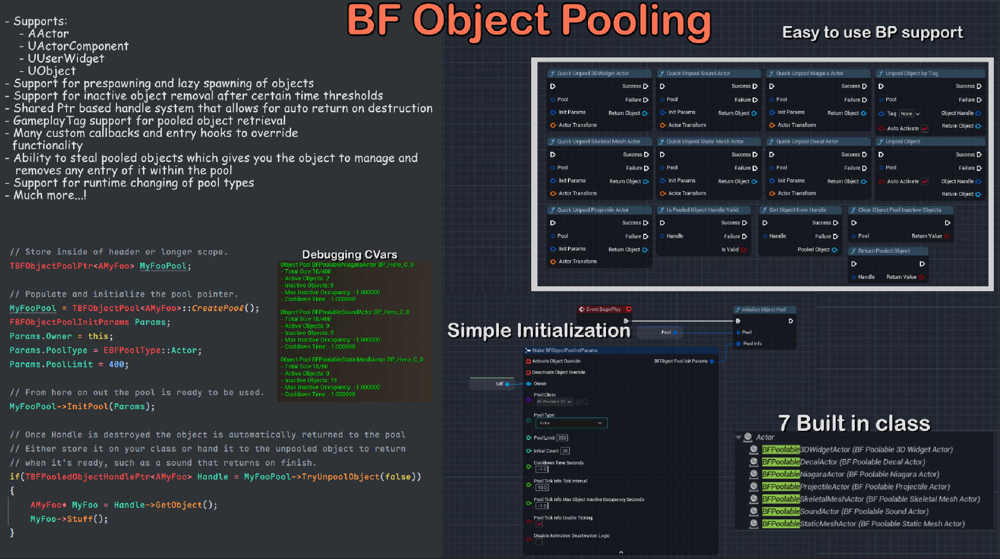

# BF Object Pooling
BF Object Pooling aims to be a simple to use yet powerful generic object pooling solution.





---

### Overview
- Supports C++ first class with templates in mind and full operability with blueprint

- Various Customization options so each pool can be totally different from the last
	- Custom override delegates for activation/deactivation at the pool level (Allows you to implement your own special functionality for that behaviour and bypass the pools)
	- Custom activation/deactivation interface support at the pooled object level (Allows for any object logic to be performed at those stages, see `UBFPooledObjectInterface`)
	- Callbacks for object add/removal as well as when objects are leased and returned to the pool, lots of hooks.
	- Runtime changing of pool type (Assuming its of same template class or a child type, see how the BP handle does it by just using UObject).

- Supports 4 class types (and child derived types of course) which practically covers almost everything needed:
	- `AActor`
	- `UActorComponent`
	- `UUserWidget`
	- `UObject`

- Comes with **7** built in generic classes that are ready for use with lots of easy examples for implementing your own U/A unreal classes
	- Generic Projectile Actor
		- Supports Static Mesh, Niagara VFX system and Different collision shape types (Sphere, Box, Capsule) with dynamic runtime changing of the mentioned
	- Generic Decal Actor
	- Generic Sound Actor
	- Generic Skeletal Mesh Actor
	- Generic Static Mesh Actor
	- Generic 3D Widget Actor
	- Generic Niagara Actor


---


### The Key Main Components Of The Object Pool Itself Can Be Broken Into 3 Parts
1) - The Templated Struct Pool itself: `TBFObjectPool`  
		- This handles interfacing and dealing with the pooled objects.  
		- Provides an easy to use API for getting, returning and stealing objects from the pool.  


2) - The Pool Container: `UBFPoolContainer`  
	 	- This is only internally used by the pool and should not be interacted with directly.  
	 	- Stores reflected pointers of all pooled objects and some book keeping information.  


3) - The Pooled Object Handle: `TBFPooledObjectHandle` which is primary interacted with via shared pointer alias `TBFPooledObjectHandlePtr` for convenience.       
		- when attempting to un-pool an object it is returned to you via shared pointer and wrapped within this handle struct, the returned pointer may only be null due to the pool being at capacity, otherwise it will always be a valid shared pointer to your new handle.       
		- If you let all shared pointers to the handle go out of scope, the object will be returned to the pool automatically (assuming its able to and the object hasn't already been returned to the pool).  
		- BP side wraps shared pointers via a struct and has easy to use function library API for interacting with the pool.  
		- Due to sharing and copying of handle pointers you should always check for `IsHandleValid()` before using the handle if you are within a new scope where you can't be certain. This is  
			because it may have already returned itself to the pool or it may have been "Stolen" via `StealObject()`. The `IsHandleValid()` function not only checks the objects validity but also compares our handle ID to see if  
			it matches the pools latest ID, if it doesn't then the handle is considered invalid.         
			**You should never** cache the object directly but only ever access it for short scopes if you need to init or do any setup behaviour.  


---

For convenience it's recommended to include `BFObjectPooling/BFObjectPoolingCore.h`
- If you have linking issues building the plugin then please ensure whatever module is using it, also has the dependecies it has like UMG for example (See BFObjectPooling.Build.cs).

C++ Code examples

```cpp
  
 //Creation of the pool must and should be done as a shared pointer, TBFObjectPoolPtr is a using alias to make it a little nicer for TSharedPtr<TBFPoolObjectHandle<T,Mode>Mode>.  
 //Usage goes as follows:  
 
 // Decalare in header file or wherever you want to store the pool.  
 // ESP mode is optional and defaults to NotThreadSafe for perf benefits since most actors/objects are game thread bound. 
 TBFObjectPoolPtr<ABFPoolableSoundActor, ESP::ThreadSafe> MyPool;   
   


 // BeginPlay or some other init function where you want to create the pool.  
 MyPool = TBFObjectPoolPtr<ABFPoolableSoundActor>::CreatePool(); // Use static factory Create method to create the pool and make sure to Init it before ANYTHING else.  
 FBFObjectPoolInitParams Params;  
 Params.FillOutDefaults = whatever;  
 MyPool->InitPool(Params);  
   
   
 // Now during gameplay whenever you want to retrieve a pooled object you can do so like this:  
if(TBFPooledObjectHandlePtr<ABFPoolableSoundActor> Handle = ObjectPool->UnpoolObject(bAutoActivate))// Returns a pooled object via a shared handle ptr, if the param is false you must handle activating the object yourself, there is built in activation/deactivation logic already though.  
 {  
    // Do whatever you want with the object, my preferred method is to init the object and hand it back its own handle so it can do what it needs to do and return when needed. Like a sound would set the params and then return on sound finished  
    auto* Obj = Handle->GetObject(); // This will templated in c++ and in BP you get the object as a UObject* for you to then cast. Do not store Obj but just use it in scope.  
    Obj->SomeObjectFunctionToSetThingsUp()  
    Obj->SetPoolHandle(Handle); // This is a function I typically have on my pooled objects that takes the handle and stores it for later use, also invalidates your handle so you can't use it again.  
 }  


// Other functionality includes:
MyPool->UnpoolObject(bAutoActivate); // Attempts to unpool an object and return it via a shared handle ptr, the result will return a null pointer if unable to unpool an object due to pool being at capacity and all objects in use.  
MyPool->UnpoolObjectByTag(Tag, bAutoActivate);  // Only super useful if you have a pool of specific objects you want to re access, for example you can have a UUserWidget pool and each widget be different and when  wanting a specific widget  
												// you can query the pool for that tag, returns false if unable to locate within the inactive pool of objects. MyPool->ReturnToPool(Handle.ToSharedRef()); 
												// Attempts to return the handle to the pool, can fail if the handle is stale but failing is perfectly valid and expected, especially if multiple handle copies exist.  
Handle->ReturnToPool(); // Returns the object to the pool via the handle, (Typically for fire and forget pooled objects otherwise you would be holding onto the handle yourself).  
MyPool->ClearPool(); // Clears the pool of all inactive objects. We do not clear in use ones.  
MyPool->RemoveFromPool(PoolID, ObjectCheckoutID); // Removes a specific object from the pool ONLY if it is inactive and matches our ID. Will not remove active objects, use `StealObject)` for that.  
MyPool->RemoveNumFromPool(NumToRemove); // Removes a specific number of inactive objects from the pool, if unable to remove the exact amount the returns false.  
    
   
// Usage of the pools handles are as follows:  
// Handles are created and returned as shared pointers, once all pointers to a particular handle are destroyed the object is returned to the pool automatically if it hasn't already, 
// you may also manually call `ReturnToPool` or `Steal` to invalidate existing copied shared pointers to the same handle, be sure to use `Handle->IsHandleValid()` to check. 
// Code: 
TBFPooledObjectHandlePtr<ABFPoolableSoundActor> Handle = MyPool->GetPooledObject(); // Again.. Should be stored in a larger scope   
   
Handle.IsValid(); // Checks the SharedPtr if the Handle object is valid, not related to the Handle objects validity. Ideally this shouldn't be needed since the nature of a shared pointer kinda keeps it alive for you.  
Handle->IsHandleValid(); // This checks if the handle is valid, this is what you'll want most likely, you could also technically do 'Handle.Get()->IsHandleValid()' but that's a bit verbose.  
TBFPooledObjectHandlePtr<ABFPoolableSoundActor> ACopyOfMyHandlePtr = Handle; // Creates a reference counted copy of the handle, if you return the object to the pool via one of the handles, all other handles to the same object will be invalidated.  
Handle->GetObject(); // This returns the object that the handle is holding, this is what you'll want to use to get the object but do not store it.  
Handle->ReturnToPool(); // This returns the object to the pool and invalidates the handle, if there are multiple handles to the same object they will all be invalidated.  
Handle->StealObject(); // This simultaneously removes the pooled object from its owning pool, returns it and invalidates all handles to that object.


  

// Its also perfectly acceptable and even recommended to have multiple pools even on a single hero character if need be for the most usability and customization.
TBFObjectPoolPtr<ABFPoolableSoundActor> SoundPool = TBFObjectPool<ABFPoolableSoundActor>::CreatePool();  
TBFObjectPoolPtr<ABFPoolableNiagaraActor> NiagaraPool = TBFObjectPool<ABFPoolableNiagaraActor>::CreatePool();  
TBFObjectPoolPtr<ABFPoolable3DWidgetActor> WidgetPool = TBFObjectPool<ABFPoolable3DWidgetActor>::CreatePool();


// Usage of built in pooled actors goes as follows from c++ and from BP this is made easier with a single node QuickUnpoolXXXActor.
if(TBFPooledObjectHandlePtr<ABFPoolableSoundActor> SoundHandle = SoundPool->UnpoolObject(bAutoActivate))  
{  
	FBFPoolableSoundActorDescription Desc;
	Desc.Sound = MySound;
	Desc.WhateverElse ...

	 // Takes ownership of the handle and returns when sound finishes, I could have a looping sound and set a Desc.ActorCurfew = 300.f; and it would return after 5 minutes.
	SoundHandle->GetObject()->FireAndForget(SoundHandle, Desc, DesiredTransform); 
}
```


Please make sure to report any issues and I'll try my best to get back to you.


