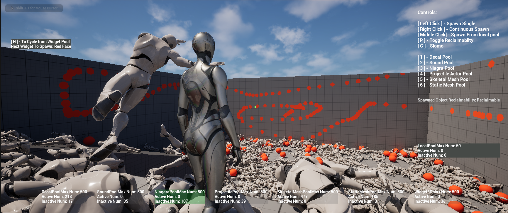
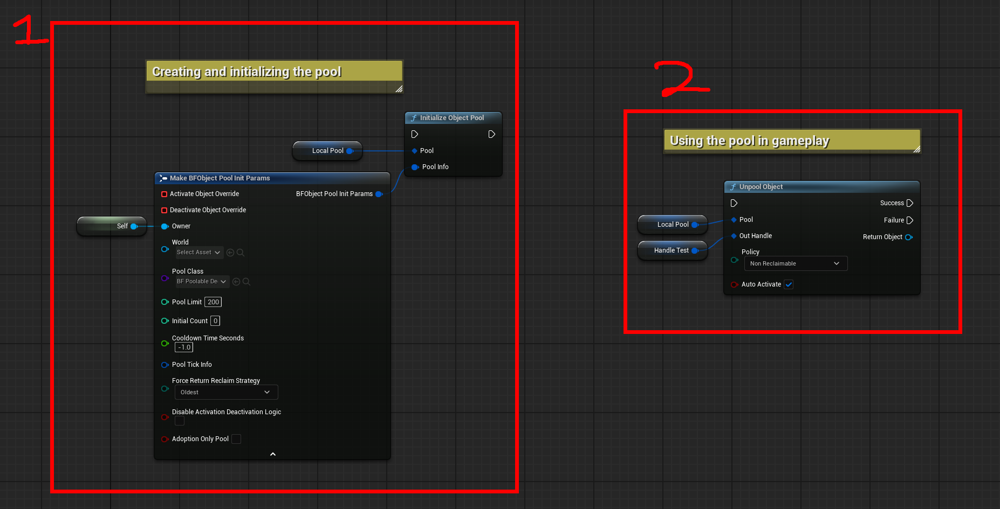

# BF Object Pooling
BF Object Pooling aims to be a simple to use yet powerful generic object pooling solution.
<br>



Screen shot from the provided example project showing the plugin in action.

---

Repo comes with an example project (in UE 5.5.3) that demonstrates how to use the plugin in both C++ and mostly Blueprints. 
This plugin itself does not require 5.5.3 but the project example does, it's worth taking a look at.


### Overview

- Built for ease of use in both C++ and Blueprints 

- Comes with a Gameplay FX World Subsystem which is globally accessible and can be used to spawn VFX, SFX, Decals, Meshes and more with ease.
	- Each pool is not limited to any one owner type though so you don't need to use the subsystem if you don't want to, your main character might have its own pool for example. 
	They are supposed to be flexible and easy to use in any context.

- The Pool itself supports 4 class types (and child derived types of course) which practically covers almost everything needed:
	- `AActor`
	- `UActorComponent`
	- `UUserWidget`
	- `UObject`

- Comes with **7** built in generic classes that are ready for use with lots of easy examples for implementing your own U/A unreal classes
	- Generic Decal Actor
	- Generic Sound Actor
	- Generic Niagara Actor
	- Generic Projectile Actor
		- Supports Static Mesh, Niagara VFX system and Different collision shape types (Sphere, Box, Capsule) and more
	- Generic Skeletal Mesh Actor
	- Generic Static Mesh Actor
	- Generic 3D Widget Actor


- Various Customization options so each pool can be totally different from the last such as:
	- Custom override delegates for activation/deactivation at the pool level (Allows you to implement your own special functionality for that behaviour and bypass the pools default behaviour)
	- Custom activation/deactivation interface support at the pooled object level (Allows for fine grained object logic to be performed at various stages, see `UBFPooledObjectInterface`)
	- Callbacks for object add/removal as well as when objects are unpooled and returned.

- Supports UObject ownership of the pool so no reliance on Actors owning it, which is great for subsystems (Unless the pool is UserWidget type, you must set the owner to a compatible widget owner type.)

- Support for Stealing and Adopting objects, this is as it sounds:
	- Stealing an object removes it from the pool and returns it to you to own and do with as you please.
	- Adopting an object is the opposite and the pool will take in the object (assume we aren't already full).

- Uses a concept of a `Reclaim Policy` which is basically just a fancy way to say how important a specific object is to you if you unpool it successfully. There are two values:
	- `Reclaimable` which means if the pool is all out of inactive objects and a new user is requesting an object we can force return an object to the pool and give it to the new user. (How we determine which object gets returned is decided from the `Reclaim Strategy` enum set at the pools initialization)
	- `NonReclaimable` which means the object is ours and ours only to handle, nothing can force it back until we either release all our handles, steal the object or return it to the pool ourselves.

- Support for unpooling objects via **GameplayTags** or **Predicates** as well as just a generic unpooling which will return the first available object.
	- Specific unpooling is useful for pools of different objects but share a parent class which the pool is of, for example a pool of `UUserWidget` 
	objects where each widget is different and you want to query the pool for a specific widget (See the example project for a minimal example).


---


### The Key Main Components Of The Object Pool Itself Can Be Broken Into 3 Parts
 
1) The Templated Struct Pool itself: `TBFObjectPool` or in BP `BFObjectPool` which wraps this struct templated on a UObject.
	- The pool itself is responsible for maintaining the pooled objects while they are in an inactive state as well as providing an API for being interacted with.
	- The pool should be stored only as a shared pointer to the pool itself, this means either `TSharedPtr<TBFObjectPool<T, Mode>, Mode>` (which is verbose) or use the using alias `TFBObjectPoolPtr<T, Mode>` 
	- The only time you will need to referer to the pool as `TBFObjectPool` instead of `TBFObjectPoolPtr` is when first setting your pointer and creating the pool like so `MyPool = TBFObjectPool<MyType>::CreatePool()`

 <br>
 		
 
2) The Pooled Object Handle: `TBFPooledObjectHandle` which is primary interacted with via shared pointer alias `TBFPooledObjectHandlePtr` for the same convenience reasons or in BP as `BFPooledObjectHandle`.
	- When attempting to un-pool an object it is returned to you via shared pointer to the handle (`TBFPooledObjectHandle`), if the unpooling is unsuccessful like due to being at pool capacity the handle is a nullptr.
	- If you let all shared pointers to the handle go out of scope the pooled object will be returned to the pool automatically (assuming its able to and the object hasn't already been returned to the pool or stolen).
	- BP side wraps shared pointers via a value struct that copied around and stored, it has easy to use function library API for interacting with the pooled object.
	- Due to sharing and copying of handle pointers you should always check for `IsHandleValid()` before using the handle if you are within a new scope where you can't be certain. This is
	because it may have already returned itself to the pool or it may have been "Stolen" via `StealObject()`. The `IsHandleValid()` function not only checks the objects validity but also compares our handle ID to see if
	it matches the pools latest ID, if it doesn't then the handle is considered invalid. This is not however required as when you call `MyHandle->GetObject` or the BP equivalent it already checks and makes sure the handle is valid.
	- You should never cache the object directly but only ever access it for short scopes if you need to init or do any setup behaviour.

<br>

3) The Pool Container: `UBFPoolContainer`
	- UObject that is used to wrap pooled objects storage in a GC friendly way, handle ticking the pool and stores other meta data about the pooled objects.
	- Should never be interacted with directly.

<br>

---

Installation Steps:
- Clone the repo and copy the `BFObjectPooling` folder into your own projects `Plugins` folder at the root of your project, if you do not already have one then just make a folder 
along with your .uproject called `Plugins` and paste the `BFObjectPooling` folder inside. That should be it for BP only usage, plugins are automically loaded and usable in editor.
- If you wish to use the plugin from c++, you now need to go into the module you wish to use the plugin with (this could just be your projects module located in the Source folder) and 
from there locate your modules `MyModule.Build.cs` file and add the following line (or just append the modules to your existing dependencies). 
`PublicDependencyModuleNames.AddRange(new string[] { "BFObjectPooling", "UMG" });` and that's it. 
Enjoy 😊


Tips:
- For custom pooled actors (that arent my default provided ones) I recommend mimicking how I have functionality to hand the unpooled actor back its handle 
so it can return itself to the pool when it's done. See ABFPoolableSoundActor::FireAndForget for an example.
- Use the core header `BFObjectPooling/BFObjectPoolingCore.h` which has all the includes conveniently in one place.
- If you have linking issues building the plugin then please ensure whatever module is using it, also has the dependecies it has like UMG for example (See BFObjectPooling.Build.cs).


--- 

#### C++ and BP examples

##### BP Side:




<br>

##### C++ Side:

```cpp

 // .h
 // Declare a shared pointer to the pool, this is the only way you should store the pool.
 TBFObjectPoolPtr<AMyFoo> MyPool; 


// .cpp
// Use static factory Create method to create the pool and make sure to Init it before ANYTHING else.
MyPool = TBFObjectPoolPtr<AMyFoo>::CreatePool();


// After creation the next step is populate the init params, the only *required* params are
//	- Owner (you also need to populate the World pointer if the owner has no way to access the world via GetWorld())
//	- PoolClass
FBFObjectPoolInitParams Params;
Params.Owner = this;
Params.PoolClass = AMyFoo::StaticClass() or MyEditorPopulatedTSubclassOf<AMyFoo>();
Params.PoolLimit = 100;
Params.InitialCount = 5;

// Initialize the pool and done, its ready to use!
MyPool->InitPool(Params);
 
// or for a combined creation and initialization use the factory method
// MyPool = TBFObjectPoolPtr<AMyFoo>::CreateAndInitPool(Params);


 // IN GAMEPLAY now you can just access pooled objects like so, this is literally all thats needed after initialization to use your pool.

// Returns a pooled object via a shared handle ptr, if the param is false you must handle activating the object yourself, there is built in activation/deactivation logic already though.
if(TBFPooledObjectHandlePtr<AMyFoo> Handle = ObjectPool->UnpoolObject(bAutoActivate))
{
	// Do whatever you want with the object, my preferred method is to init the object and hand it back its own handle so it can do what it needs to do and return when needed. 
	// Like a sound would set the params and then return on sound finished
	auto* Obj = Handle->GetObject(); // This is templated in c++ and in BP you get the object as a UObject* for you to then cast. Do not store Obj but just use it in scope.
	Obj->SomeObjectFunctionToSetThingsUp()
	Obj->SetPoolHandle(Handle); // This is a function I typically have on my pooled objects that takes the handle and stores it for later use, also invalidates your handle so you can't use it again.
}
```


<br>

Please make sure to report any issues and I'll try my best to get back to you.
- [Twitter](https://twitter.com/itsBaffled)


